---

# Pterodactyl Installer

A streamlined script to automate the installation and configuration of Pterodactyl, an open-source game server management panel, tested on Ubuntu 20.04.6 LTS.

---

## Features

- **Automated Setup:** Easily deploy Pterodactyl with minimal user input.
- **Customizable Allocations:** Adjust server and node specifications with simple configurations.
- **Built-in Examples:** Pre-configured examples to help you get started with ease.

---

## Installation Guide

### Prerequisites

- An Ubuntu 20.04.6 LTS server.
- Root or sudo access to the server.

---

### Steps

1. **Prepare the Environment**  
   Ensure your Ubuntu server is set up and updated.

2. **Clone the Repository**
   ```bash
   git clone https://github.com/Roman-Emperor-42/pterodactyl-installer.git
   cd pterodactyl-installer/
   chmod +x install_pterodactyl.sh
   sudo ./install_pterodactyl.sh
   ```
3. **Install Composer Dependencies**  
   When prompted, type `yes` to allow the superuser composer installation.
   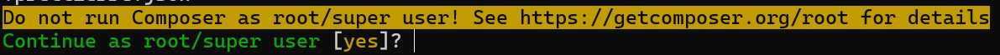

4. **Configure Email for Egg Handler**  
   Enter a valid email address for the egg handler when prompted.
   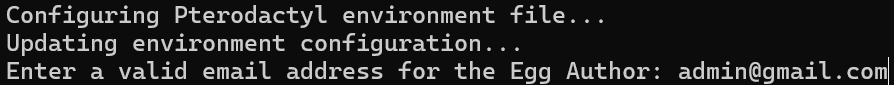

5. **Access the Web Interface**  
   Open your web browser and go to:
   - `http://127.0.0.1`
   - `http://localhost`
   - Or the server's IP address.

6. **Sign In**  
   Default credentials:
   - **Username:** `admin`
   - **Password:** `Admin1234`
   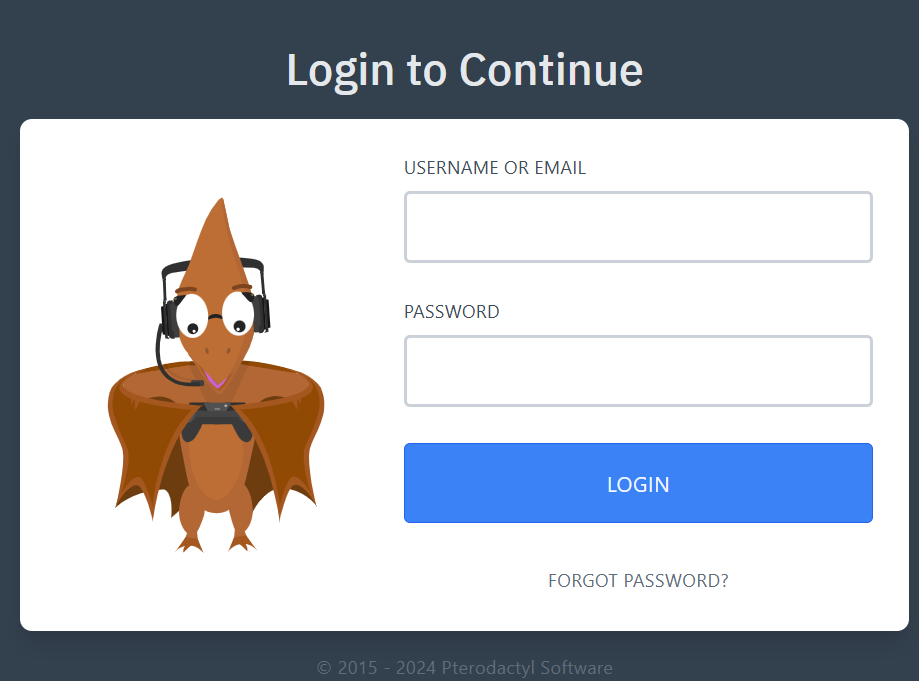

7. **Navigate to Admin Area**  
   Set up administrative configurations.
   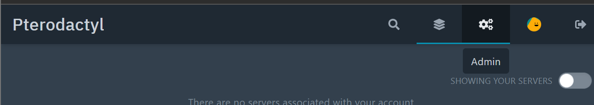


9. **Create a Location**  
   Example:
   - **Location Name:** `local.server.1`
   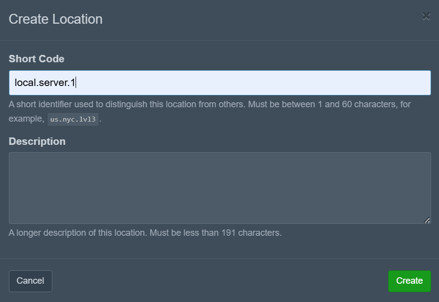

10. **Set Up a Node**  
   Example configuration:
   - **Name:** `test-node`
   - **FQDN:** `localhost`
   - **Connection Type:** HTTP
   - **Memory:** `4000 MB`
   - **Disk Space:** `10000 MB`
   - **Over-Allocation:** `-1`
   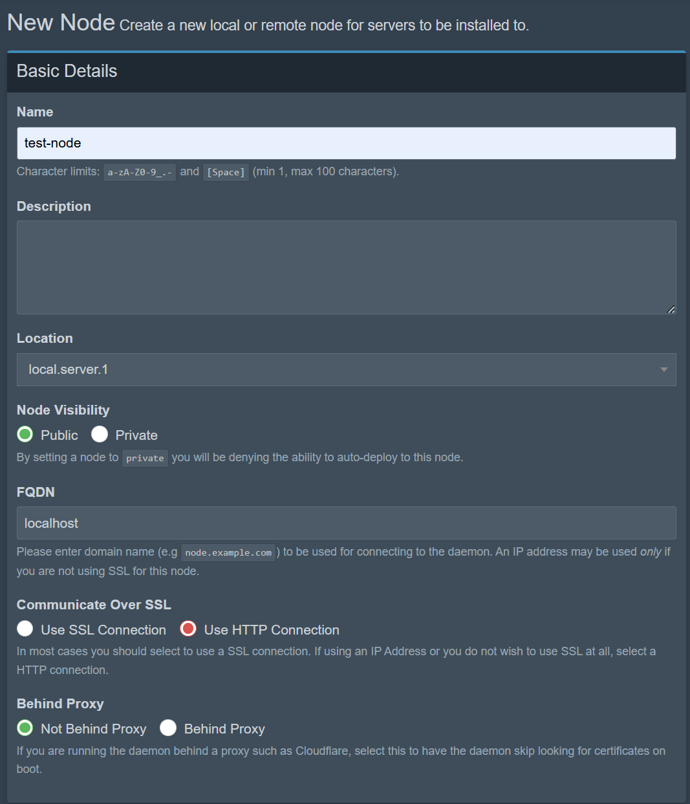  
   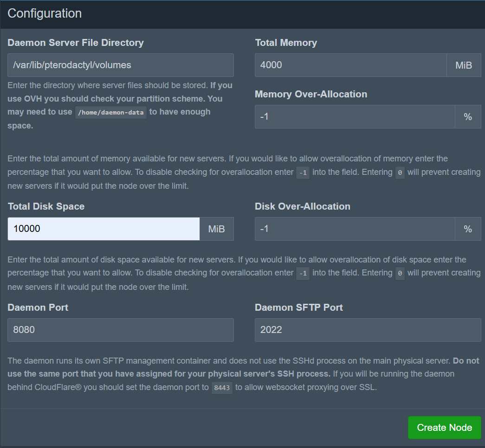

11. **Allocate Resources**  
    Add IP and ports:
    - Example IP: `10.0.2.15`
    - Ports: `27000-27010`
    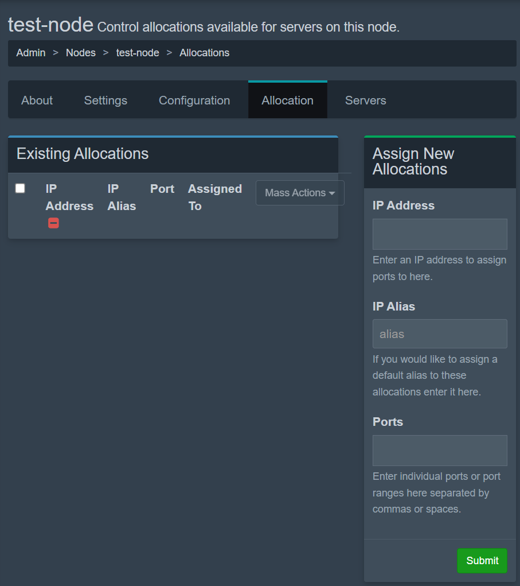  
    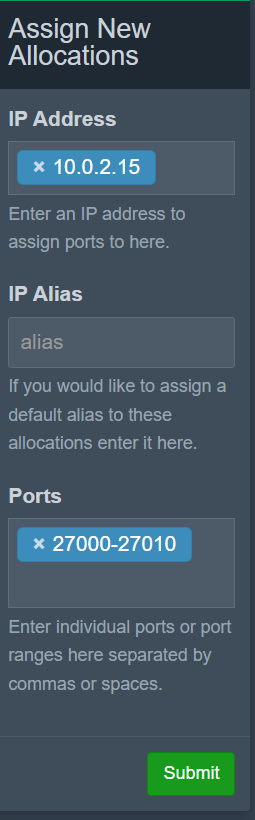

12. **Generate Configuration Token**  
    In the Config tab, generate a token. Copy the token command and run it in the terminal. Overwrite the file if prompted.
    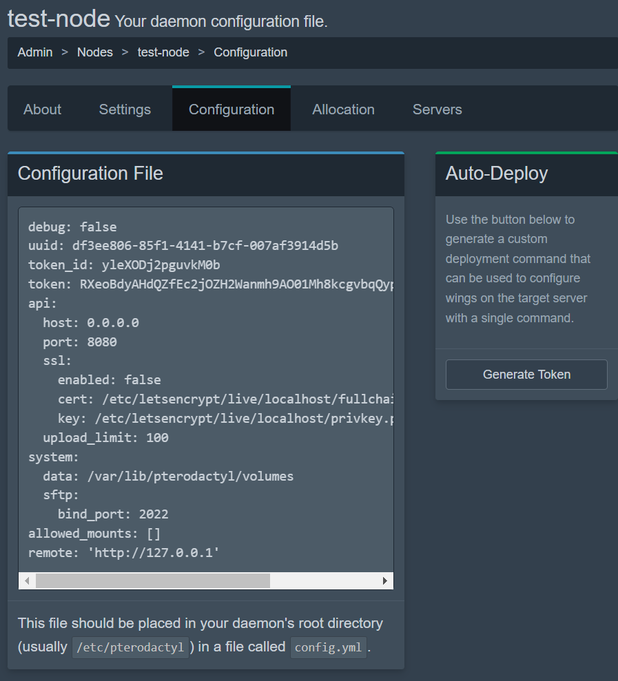  
    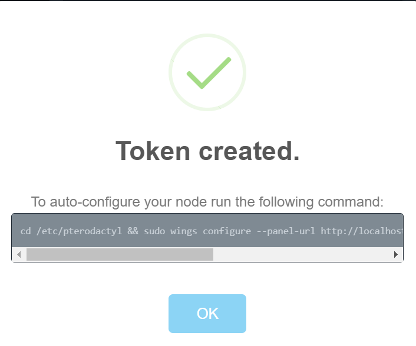  
    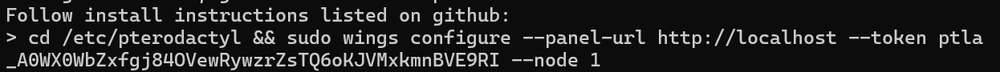

13. **Create a Game Server**  
    Example configuration:
    - **Server Name:** `test-server`
    - **Owner:** `admin`
    - **Default Allocation:** A previously allocated port.
    - **RAM Limit:** `5000 MB`
    - **Disk Space:** `8000 MB`
    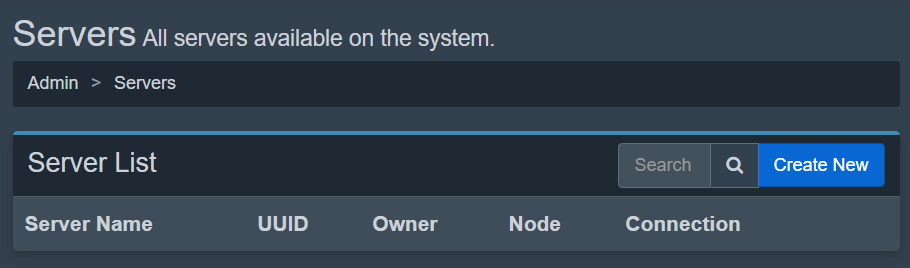  
    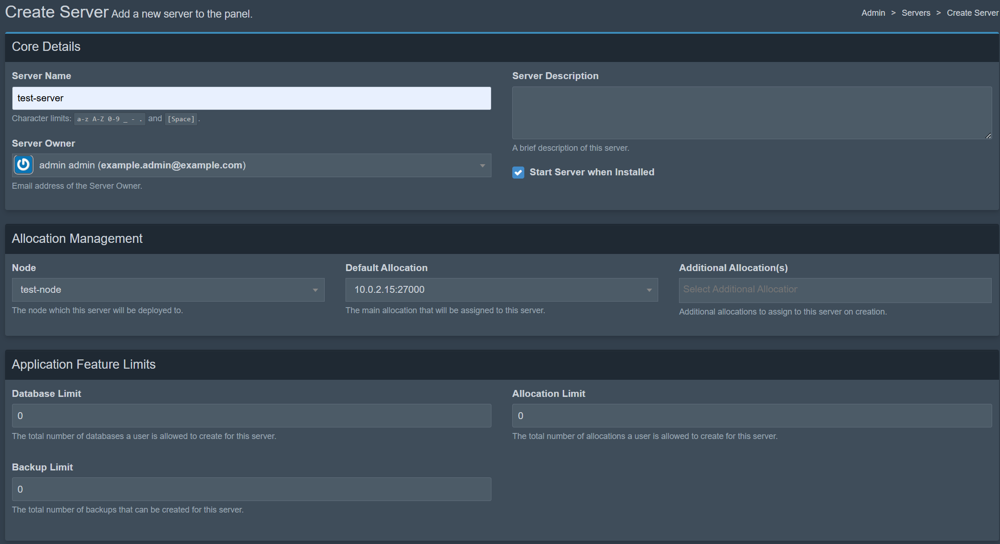  
    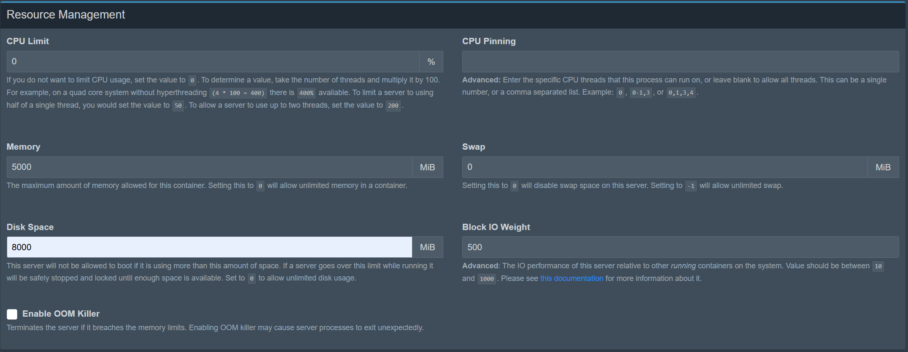  
    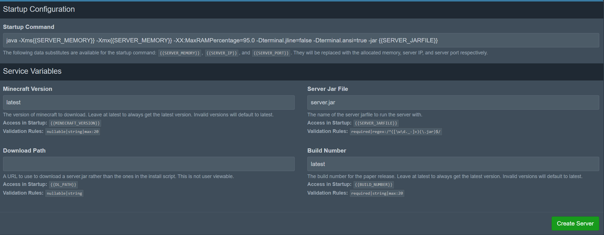  
    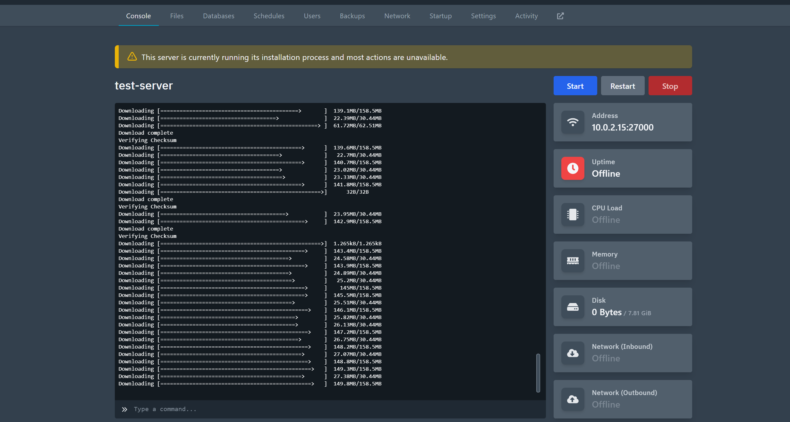

14. **Finalize and Play**  
    The server will install. Adjust configurations as needed to play your favorite games.
    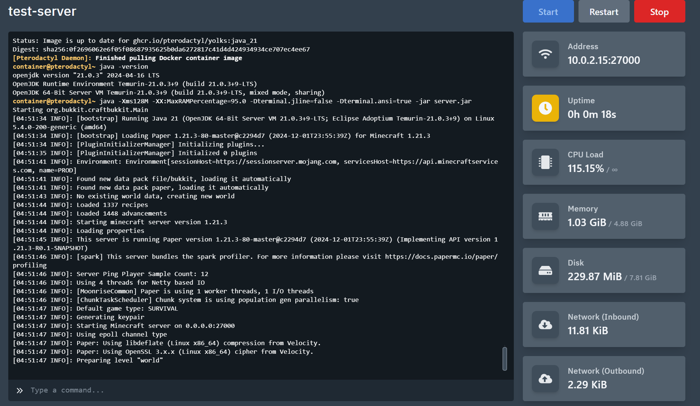

---

## Usage

- Easily modify server or node specifications through the admin interface.
- Allocate more or less memory and disk space as required.

---

## Troubleshooting

For any issues during installation or configuration, refer to the [Pterodactyl documentation](https://pterodactyl.io) or submit an issue in this repository.  

You can easily allocate more resources to the node by the process below.
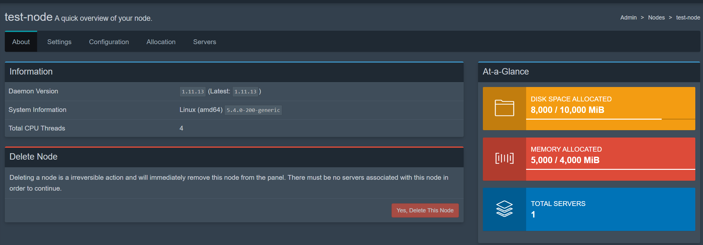  
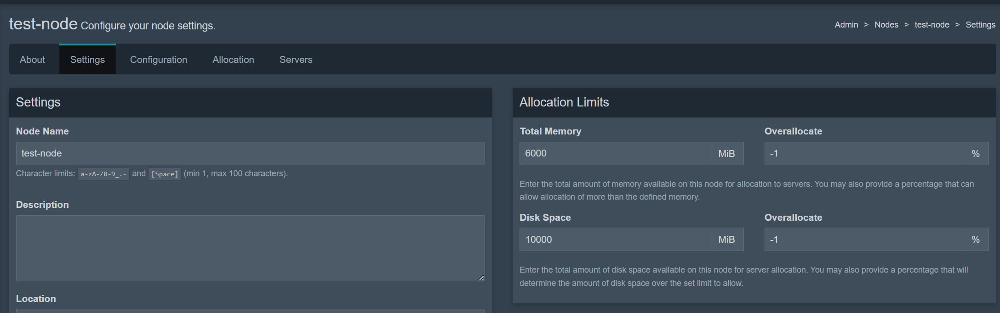  
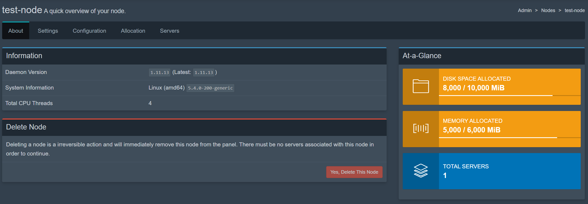

---

## Contributing

Contributions are welcome! Please fork the repository and submit a pull request with your changes.

---

## License

This project is licensed under the MIT License. See the `LICENSE` file for details.
